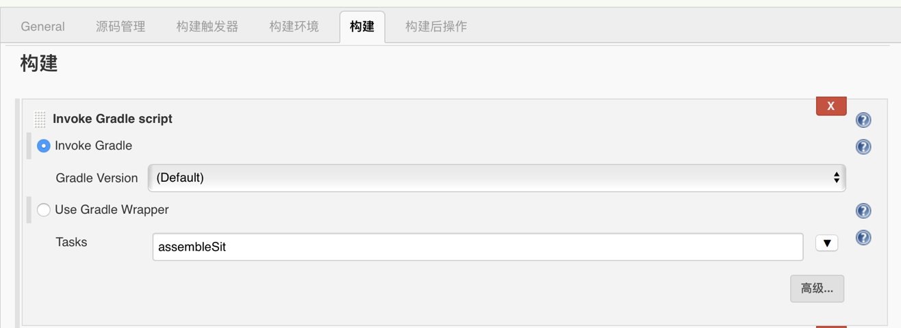

#### iOS应用构建

+xcodebuild+是苹果提供打包项目或工程的命令，了解该命令最好的方式就是使用+man xcodebuild+查看其 man page，以下是关于使用部分的描述。
```
NAME
     xcodebuild -- build Xcode projects and workspaces

SYNOPSIS
     xcodebuild [-project name.xcodeproj]
                [[-target targetname] ... | -alltargets]
                [-configuration configurationname]
                [-sdk [sdkfullpath | sdkname]] [action ...]
                [buildsetting=value ...] [-userdefault=value ...]

     xcodebuild [-project name.xcodeproj] -scheme schemename
                [[-destination destinationspecifier] ...]
                [-destination-timeout value]
                [-configuration configurationname]
                [-sdk [sdkfullpath | sdkname]] [action ...]
                [buildsetting=value ...] [-userdefault=value ...]

     xcodebuild -workspace name.xcworkspace -scheme schemename
                [[-destination destinationspecifier] ...]
                [-destination-timeout value]
                [-configuration configurationname]
                [-sdk [sdkfullpath | sdkname]] [action ...]
                [buildsetting=value ...] [-userdefault=value ...]

     xcodebuild -version [-sdk [sdkfullpath | sdkname]] [infoitem]

     xcodebuild -showsdks

     xcodebuild -showBuildSettings
                [-project name.xcodeproj | [-workspace name.xcworkspace -scheme schemename]]

     xcodebuild -showdestinations
                [-project name.xcodeproj | [-workspace name.xcworkspace -scheme schemename]]

     xcodebuild -list [-project name.xcodeproj | -workspace name.xcworkspace]

     xcodebuild -exportArchive -archivePath xcarchivepath -exportPath
                destinationpath -exportOptionsPlist path

     xcodebuild -exportLocalizations -project name.xcodeproj -localizationPath
                path [[-exportLanguage language] ...]
     xcodebuild -importLocalizations -project name.xcodeproj -localizationPath
                path
```
根据上述介绍，我们可以很清楚的知道如何使用命令行构建一个 IPA 包。[HrtBuildIpa.sh](https://github.com/whihail/AutoArchive/blob/master/HrtBuildIpa.sh) 就实现了这个功能，不废话，直接贴代码：
``` Shell
function buildIpa() {  #构建企业包

    # 参数$1：xcworkspace文件路径
    # 参数$2：需要构建的target名字
    # 参数$3：xcarchive文件相对路径
    # 参数$4：包需要存放的相对路径
    # 参数$5：这里用不到，可不传
    WORK_SPACE=$1
    TARGET_NAME=$2
    XCARCHIVE=$3
    IPAPATH=$4
    IPANAME=$5

    # 开始计时
    SECONDS=0

    # 清理
    echo "\n\n\033[32m +++++++++++++++++清理中+++++++++++++++++\033[0m\n\n\n"
    xcodebuild -workspace "${WORK_SPACE}" -scheme "${TARGET_NAME}" -configuration 'Release' clean

    # 编译
    echo "\n\n\033[32m +++++++++++++++++编译中+++++++++++++++++\033[0m\n\n\n"
    xcodebuild -workspace "${WORK_SPACE}" -sdk iphoneos -scheme "${TARGET_NAME}" -archivePath "./build/${XCARCHIVE}" -configuration 'Release' archive

    # 打包
    echo "\n\n\033[32m +++++++++++++++++打包中++++++++++++++++++\033[0m\n\n\n"
    xcodebuild -exportArchive -archivePath "./build/${XCARCHIVE}" -exportPath "./build/${IPAPATH}" -exportOptionsPlist "./EnterpriseExportOptionsPlist.plist" -allowProvisioningUpdates

    # 验证
    if [ -f "./build/${IPAPATH}" ] ; then
    	echo "\n\n\033[32m +++++++++++++++++打包成功，用时 ${SECONDS}s ++++++++++++++++++\033[0m\n\n\n"
    else
    	echo "\n\n\033[32m +++++++++++++++++打包失败++++++++++++++++++\033[0m\n\n\n"
}

buildIpa $1 $2 $3 $4 $5
```
由于我的项目使用的是 workspace，所以清理和编译部分中使用了 -workspace 和 -scheme 参数，如项目使用的是 project，则只需使用 -project 参数就行了。
打包过程中会使用参数 -exportOptionsPlist 参数，此参数需要一个 Plist 文件对打包进行配置。在实际的项目中，一般我们会打两种包，一种企业包进行内测分发，一种AppStore包对外发布，所有我在每个工程项目中都会放两个 Plist 配置文件分布对应这两种打包方式，下面代码是 [EnterpriseExportOptionsPlist.plist](https://github.com/whihail/AutoArchive/blob/master/EnterpriseExportOptionsPlist.plist) 的配置，另外还有 [AppStoreExportOptionsPlist.plist](https://github.com/whihail/AutoArchive/blob/master/AppStoreExportOptionsPlist.plist) 的配置与之类似，就不瞎贴啦。

```XML 
<?xml version="1.0" encoding="UTF-8"?>
<!DOCTYPE plist PUBLIC "-//Apple//DTD PLIST 1.0//EN" "http://www.apple.com/DTDs/PropertyList-1.0.dtd">
<plist version="1.0">
<dict>
	<key>compileBitcode</key>
	<false/>
	<key>method</key>
	<string>enterprise</string>
	<key>provisioningProfiles</key>
	<dict>
		<key>#Bundle Identifier</key>
		<string>#描述文件名</string>
	</dict>
	<key>signingCertificate</key>
	<string>#打包证书名</string>
	<key>signingStyle</key>
	<string>manual</string>
	<key>stripSwiftSymbols</key>
	<true/>
	<key>teamID</key>
	<string>#teamID</string>
	<key>thinning</key>
	<string>&lt;none&gt;</string>
</dict>
</plist>
```

#### Android应用构建

**环境搭建**
1. 安装 JDK，之前的文章有说过，如果你运行了 Jenkins，那说明你的 JDK 已安装到你的 Mac 电脑，安装方法就不做描述。
2. 安装 Android Studio，直接网上搜索下载安装，非常简单。
3. 安装 ADK（Android SDK）,通过 Android Studio 可以方便的进行下载安装，由于文件较大，可能需要等待较长时间，请稍安勿躁。
4. Android adb 命令配置，在 .bash_profile 文件中加入 Android SDK platform-tools 的路径，格式为 export PATH=${PATH}:路径地址。

**配置gradle命令**
通过 brew 命令进行安装：
```
brew install gradle
```
安装后验证是否成功：
```
gradle -version
```
如出现类似以下信息则代表成功：
```
cjmdeMacBook-Pro:~ chengjiaming$ gradle -version
Gradle 4.3
Build time:   2017-10-30 15:43:29 UTC
Revision:     c684c202534c4138b51033b52d871939b8d38d72
Groovy:       2.4.12
Ant:          Apache Ant(TM) version 1.9.6 compiled on June 29 2015
JVM:          1.8.0_151 (Oracle Corporation 25.151-b12)
OS:           Mac OS X 10.13.4 x86_64
```
**Jenkins配置**
在 Android 应用的构建中，需要使用到一个名叫 [Gradle plugin](https://wiki.jenkins.io/display/JENKINS/Gradle+Plugin) 的 Jenkins 插件，以下配置由此插件提供，在构建配置项点击+增加构建步骤+，选择+Invoke Gradle script+，勾选+Invoke Gredle+。
Gradle Version ：选择（Default）
Tasks ：填写 Android 中需要构建的 Task。
