Jenkins 提供了两种方式的配置来实现邮件通知功能。
一种是 Jenkins 内置默认的邮件通知，但是由于功能局限单一，比如无法提供详细的邮件内容、无法定义发送邮件的格式、无法定义灵活的邮件接收配置等，所以此处只用它来测试邮件配置信息的有效性。
另外一种是通过安装 Eamil Extension Plugin 插件，使用该插件来发送邮件通知，我们的邮件提醒通知主要使用这种方式进行配置。

#### 使用Jenkins内置默认的邮件通知配置测试有效性
1、点击 +系统管理+->+系统设置+，找到 Jenkins Locaction 项填入 Jenkins URL 和系统管理员邮件地址，系统管理员邮件地址一定要配置，否则发不了邮件通知。因为邮件通知都是由系统管理员的邮箱发出来的。
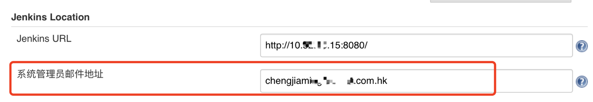

2、找到邮件通知项，填入 SMTP 服务器信息及用户名、密码等认证信息，选中通过发送测试邮件测试配置，点击 Testconfiguration 按钮，如果如图所示，则表示配置成功。
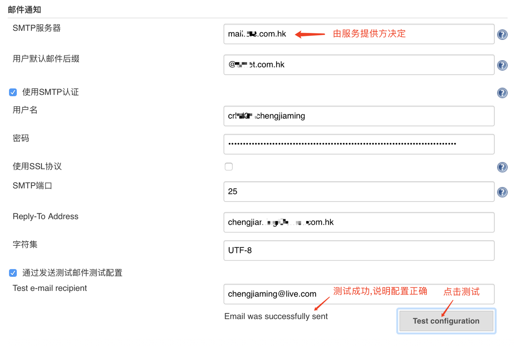

3、这时在邮件中应该能看到刚刚我们发送的测试邮件啦，至此，内置邮件配置的作用已完成。
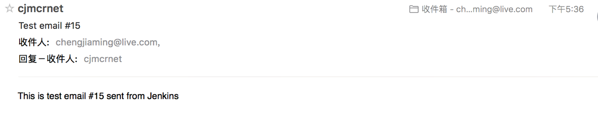

#### 使用Email Extension Plugin插件配置邮件通知

**全局配置**
同样点击 +系统管理+->+系统设置+，找到 Extension E-mail Notification 项进行全局配置。
基本信息 :  填写上述测试并正确的邮件信息
Default Content Type：默认内容类型，选择 HTML(text/html)
Default Subject ：默认邮件主题
Default Content : 默认内容，此处我填写的是一段 HTML 文本
Default Triggers ：选择 Failure(Any) 和 Success
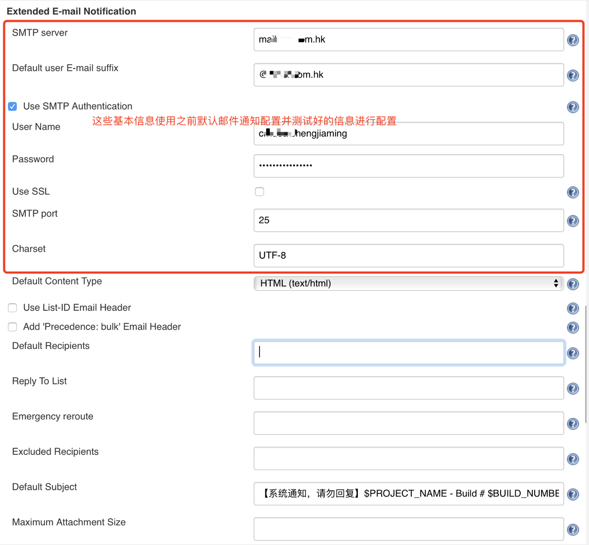
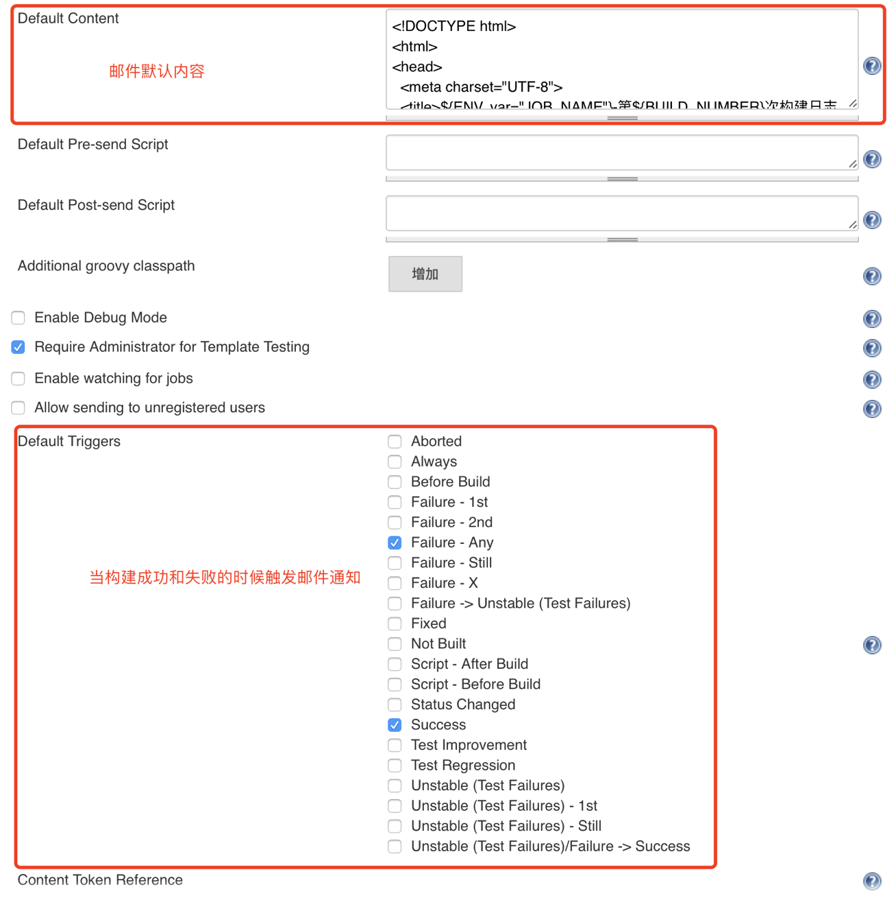

邮件默认内容如下：
```
<!DOCTYPE html>  
<html>  
<head>  
  <meta charset="UTF-8">  
  <title>${ENV, var="JOB_NAME"}-第${BUILD_NUMBER}次构建日志</title>  
</head>  

<body leftmargin="8" marginwidth="0" topmargin="8" marginheight="4"  
offset="0">  
<table width="95%" cellpadding="0" cellspacing="0"  
style="font-size: 11pt; font-family: Tahoma, Arial, Helvetica, sans-serif">  
<tr>  
  <td><br />  
    <b><font color="#0B610B">构建信息</font></b>  
    <hr size="2" width="100%" align="center" />
  </td>  
</tr>  
<tr>  
  <td>  
    <ul>  
      <li>项目名称 ：${PROJECT_NAME}</li>  
      <li>构建状态 ：${BUILD_STATUS}</li>
      <li>构建编号 ：第${BUILD_NUMBER}次构建</li>  
      <li>触发原因 ：${CAUSE}</li>  
      <li>构建日志 ：<a href="${BUILD_URL}console">${BUILD_URL}console</a></li>  
      <li>构建URL ：<a href="${BUILD_URL}">${BUILD_URL}</a></li>  
      <li>工作目录 ：<a href="${PROJECT_URL}ws">${PROJECT_URL}ws</a></li>  
      <li>项目URL ：<a href="${PROJECT_URL}">${PROJECT_URL}</a></li>  
    </ul>  
  </td>  
</tr>  
<tr>  
  <td><b><font color="#0B610B">变更集</font></b>  
    <hr size="2" width="100%" align="center" />
  </td>  
</tr>  

<tr>  
  <td>${JELLY_SCRIPT,template="html"}<br/>  
    <hr size="2" width="100%" align="center" />
  </td>  
</tr>  

</table>  
</body>  
</html>  
```

**项目配置**
进入到具体的项目配置界面点击“配置”，在配置界面点击“增加构建后操作步骤”，选择“Editable Email Notification”，在设置中保存默认就可以啦。
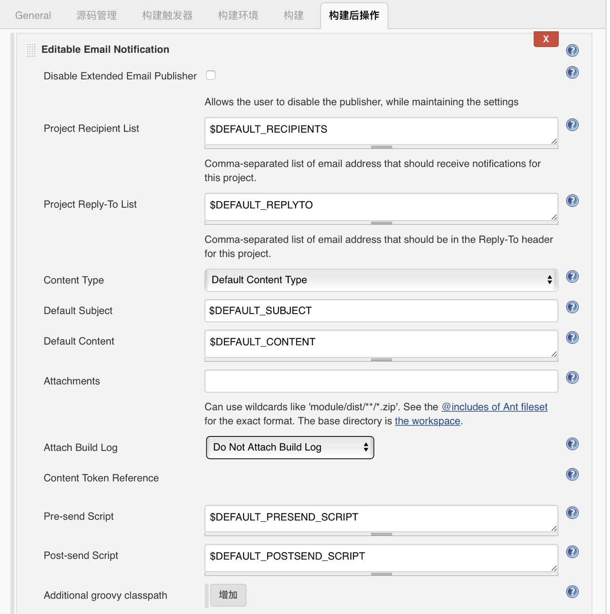

可以在“Advanced Settings”中针对项目进行个性化设置。
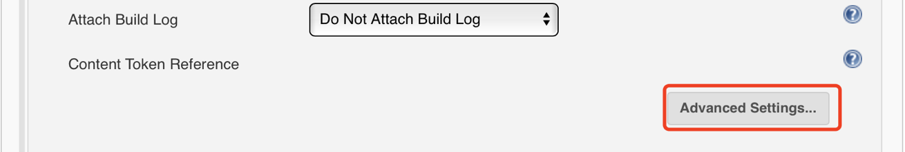

当项目构建失败触发邮件通知时的设置
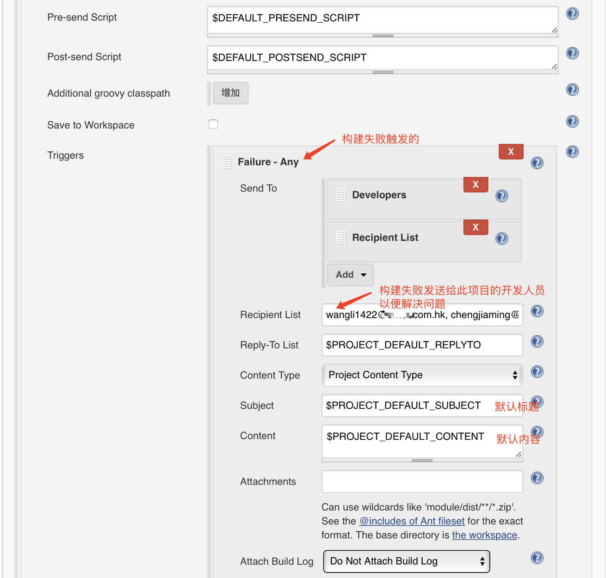

当项目构建成功触发邮件通知时的设置
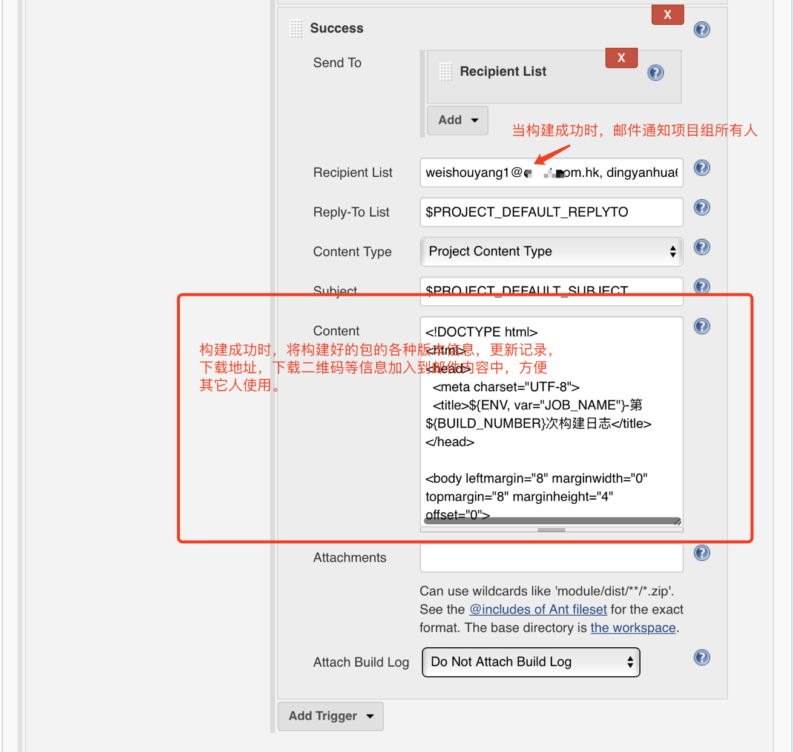

构建成功后，收到邮件通知
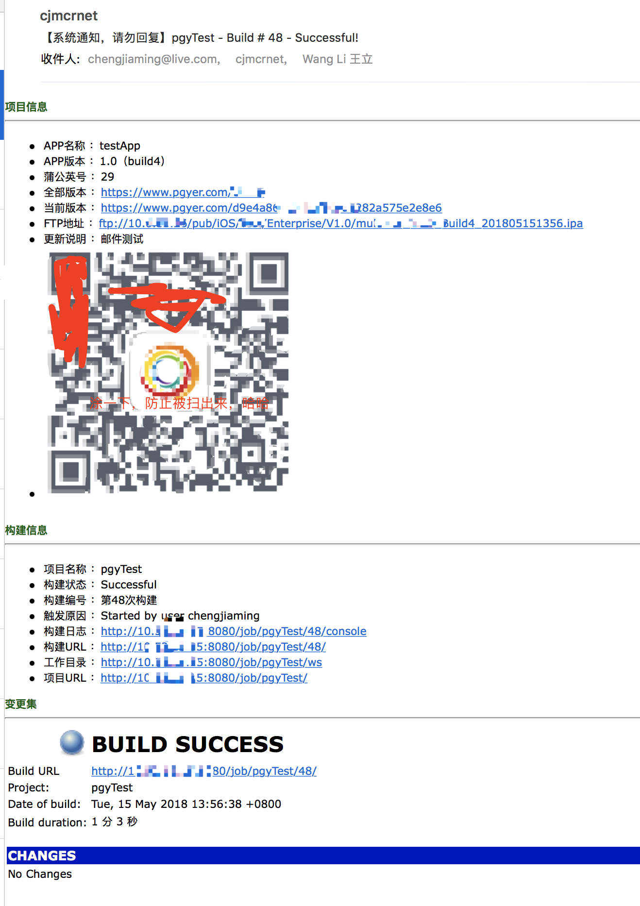

**构建布置之间进行传值**
如果稍微仔细就会发现，收到的邮件通知中包含了一些非环境变量的内容，比如说APP版本、当前版本、全部版本、FTP地址、二维码等信息。关于这个功能，我们使用到了一个插件（[Environment Injector Plugin](https://wiki.jenkins.io/display/JENKINS/EnvInject+Plugin)），此插件可以通过读取文件中的变量，将其变为系统环境变量，方便我们之后的使用。
进入到项目配置界面点击“配置”，在配置界面点击“增加构建步骤”，选择“Inject environment variables”，在 Properties File Path 中填写文件路径，最好写完整路径，经验告诉我相对路径有可能读取失败。
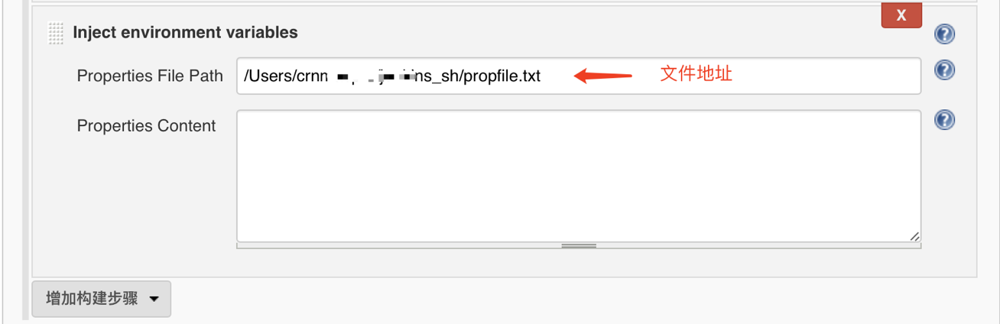

上述文件是在构建过程中将变量值输出到文件中保存，代码如下：
```
# 删除旧文件
if [ -f ~/jenkins_sh/propfile.txt ] ; then
     rm ~/jenkins_sh/propfile.txt
fi

# 输出变量到文件
echo "JOB_APP_NAME   =$appName\n"         > ~/jenkins_sh/propfile.txt
echo "JOB_APP_VERSION=$appVersion\n"      >> ~/jenkins_sh/propfile.txt
echo "JOB_PGY_VERSION=$appBuildVersion\n" >> ~/jenkins_sh/propfile.txt
echo "JOB_APP_BUILD  =$appVersionNo\n"    >> ~/jenkins_sh/propfile.txt
echo "JOB_ALL_URL    =$downloadUrl\n"     >> ~/jenkins_sh/propfile.txt
echo "JOB_CRU_URL    =$cruBuildUrl\n"     >> ~/jenkins_sh/propfile.txt
echo "JOB_FTP_PATH   =$ftpPath\n"         >> ~/jenkins_sh/propfile.txt
echo "JOB_QRCODE_URL =$appQRCodeURL"      >> ~/jenkins_sh/propfile.txt
```

上述当项目构建成功后触发邮件通知时设置的邮件内容如下：
```
<!DOCTYPE html>  
<html>  
<head>  
  <meta charset="UTF-8">  
  <title>${ENV, var="JOB_NAME"}-${BUILD_NUMBER}</title>  
</head>  

<body leftmargin="8" marginwidth="0" topmargin="8" marginheight="4"  
offset="0">  
<table width="95%" cellpadding="0" cellspacing="0"  
style="font-size: 11pt; font-family: Tahoma, Arial, Helvetica, sans-serif">  
<tr>  
  <td><br />  
    <b><font color="#0B610B">项目信息</font></b>  
    <hr size="2" width="100%" align="center" />
  </td>  
</tr>  
<tr>  
  <td>  
    <ul>  
      <li>APP名称 ：${JOB_APP_NAME}</li> 
      <li>APP版本 ：${JOB_APP_VERSION}（build${JOB_APP_BUILD}）</li> 
      <li>蒲公英号 ：${JOB_PGY_VERSION}</li> 
      <li>全部版本 ：${JOB_ALL_URL}</li> 
      <li>当前版本 ：${JOB_CRU_URL}</li> 
      <li>FTP地址 ：${JOB_FTP_PATH}</li>
      <li>更新说明 ：${PackageResume}</li>
      <li>                </li>
    </ul>  
  </td>  
</tr>  
</table>  

</body>  
</html>  

# 拼上默认邮件内容
$PROJECT_DEFAULT_CONTENT
```